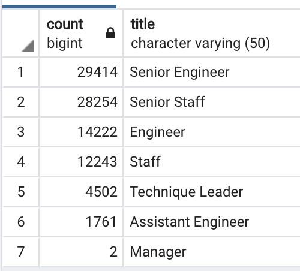
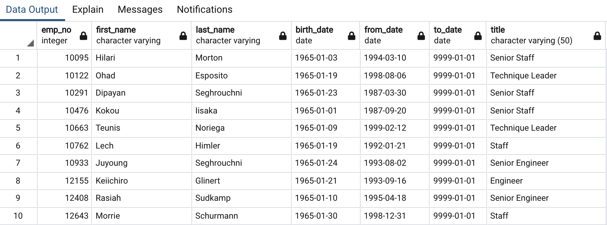

# Pewlett Hackard Analysis
# Overview of Project
## Purpose
The purpose of this challenge was to used SQL to analyze multiple data sets to assess the number of employees retiring per title and identify employees who are eligible to participate in a mentorship program.The goal of this project was to help the company prepare as many current employees reach retirement age.

# Results
## Employees Retiring
- There are 90,398 employees that are identified as retiring soon. 
- Of these employees 64% of them hold a senior title. 

## Mentorship Program
- There are 1,549 employees who are qualified for the mentorship program. 

# Summary
## How many roles will need to be filled as the "silver tsunami" begins to make an impact?
In total, there are 90,398 roles that will need to be filled as the "silver tsunami" begings to make an impact. 

## Are there enough qualified, retirement-ready employees in the departments to mentor the next generation of Pewlett Hackard employees?
In total, there are 1,549 employees that are qualified, retirement-ready employees in the departments to mentor the next generation. Knowing that the company has several thousands of employees we can assume that this is not enough people to mentor all of the next generation of Pewlett Hackard employees. 
